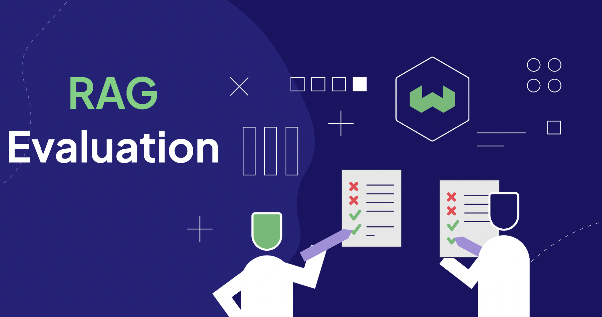
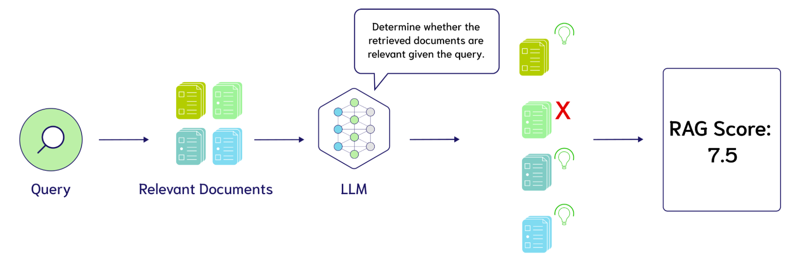

<!-- truncate -->

Retrieval Augmented Generation (RAG) is picking up steam as one of the most popular applications of Large Language Models and Vector Databases. RAG is the process of augmenting inputs to a Large Language Model (LLM) with context retrieved from a vector database, like [Weaviate](https://weaviate.io/). RAG applications are commonly used for chatbots and question-answering systems. 

Like any engineering system, evaluating performance is crucial to the development of RAG applications. The RAG pipeline is broken down into three components: 1. Indexing, 2. Retrieval, and 3. Generation. RAG Evaluation is tricky because of the series of interacting components and the strain of collecting test data. This article will present an exciting development in using LLMs to produce evaluations and the state of RAG components.

**TL;DR**: We were inspired to write this blog post from our conversation with the creators of [Ragas](https://docs.ragas.io/en/latest/), Jithin James and Shauhul Es on the [77th Weaviate podcast](https://www.youtube.com/watch?v=C-UQwvO8Koc). These new advances in using LLMs to evaluate RAG systems, pioneered by Ragas and ARES, motivated us to reflect on previous metrics and take inventory of the RAG knobs to tune. Our investigation led us to think further about what RAG experiment tracking software may look like. We also further clarify how we distinguish RAG systems from Agent systems and how to evaluate each.

Our blog post has 5 major sections:
* [**LLM Evaluations**](#llm-evaluations): New trends in using LLMs to score RAG performance and scales of Zero-Shot, Few-Shot, and Fine-Tuned LLM Evaluators.
* [**RAG Metrics**](#rag-metrics): Common metrics used to evaluate Generation, Search, and Indexing and how they interact with each other.
* [**RAG: Knobs to Tune**](#rag-knobs-to-tune): What decision makes RAG systems perform significantly different from one another?
* [**Orchestrating Tuning**](#tuning-orchestration): How do we manage tracking experimental configurations of RAG systems?
* [**From RAG to Agent Evaluation**](#from-rag-to-agent-evaluation): We define RAG as a three step procss of index, retrieve, and generate. This section describes when a RAG system becomes an Agent system and how Agent Evaluation differs.

## LLM Evaluations
Let’s start with the newest and most exciting component of all this, LLM evaluations! The history of machine learning has been heavily driven by the manual labor of labeling data, such as whether a Yelp review is positive or negative, or whether an article about nutritional supplements is related to the query, “Who is the head coach of the Boston Celtics?”. LLMs are becoming highly effective at data annotation with less manual effort. This is the key **“what’s new”** development accelerating the development of RAG applications.

The most common technique pioneered by frameworks, like [Ragas](https://docs.ragas.io/en/latest/), are Zero-Shot LLM Evaluations. Zero-Shot LLM Evaluation describes prompting a Large Language Model with a prompt template such as: “Please provide a rating on a scale of 1 to 10 of whether these search results are relevant to the query. The query is {query}, the search results are {search_results}”. The visualization below shows how an LLM can be used to evaluate the performance of RAG systems.

There are three major opportunities for tuning Zero-Shot LLM Evaluation: 1. the design of the metrics such as precision, recall, or nDCG, 2. the exact language of these prompts, and 3. the language model used for evaluation, such as GPT-4, Coral, Llama-2, Mistral, and many others. 
At the time of writing this blog post, people are mainly curious on the cost of evaluation using an LLM. Let’s use GPT-4 as an example to see the cost of evaluating 10 search results, assuming 500 tokens per result and 100 tokens for the query and instructions, totaling roughly 6,000 tokens per LLM call to make the napkin math easier. Then assuming a rate of $0.005 per 1K tokens, this would cost $3 to evaluate 100 queries.

The adoption of Zero-Shot LLM Evaluation from frameworks like Ragas is widely spreading. This has led to people questioning whether a Few-Shot LLM Evaluation is necessary. Due to its “good enough” status on the tipping scale, Zero-Shot LLM Evaluation may be all that is needed to be a north star for RAG system tuning. Shown below, the RAGAS score is made up of 4 prompts for Zero-Shot LLMs that evaluate the 2 metrics for generation, **Faithfulness** and **Answer Relevancy**, as well as 2 metrics for retrieval, **Context Precision** and **Context Recall**.

[Source](https://docs.ragas.io/en/latest/concepts/metrics/index.html)

The transition from Zero-Shot to Few-Shot LLM Evaluation is quite straightforward. Instead of using just an instruction template, we add a few labeled examples of the relevancy of linked search results to a query. This is also known as In-Context Learning, and the discovery of this technique was one of the key breakthroughs in GPT-3.

For example, adding 5 examples of human relevance ratings, we add 30,000 tokens to the prompt. Assuming the same cost as above, we 5x our cost to evaluate 100 queries from $3 to $15. Note this is a toy example and not based on the real pricing models of LLMs. A key consideration here is that adding few-shot examples may require longer context models, which are currently priced higher than smaller input LLMs.

This is already a very attractive price for producing an LLM Evaluation with Zero-Shot or Few-Shot inference, but further research suggests that the price of LLM evaluation can be further reduced with Knowledge Distillation training algorithms. This describes taking an LLM, using it to generate training data for the task of evaluation and then fine-tuning it into a smaller model. 

In [ARES](https://arxiv.org/abs/2311.09476): An Automated Evaluation Framework for Retrieval-Augmented Generation Systems, Saad-Falcon et al. found that training your own LLM evaluator can have a better performance than zero-shot prompting. To begin, “ARES requires three inputs for the pipeline: a set of passages from the target corpus, a human preference validation set of 150 annotated datapoints or more, and five few-shot examples of in-domain queries.” ARES then uses the few-shot examples of queries to generate a large dataset of synthetic queries. These queries are then filtered using the roundtrip consistency principle: Can we retrieve the document that produced the synthetic query when searching with the synthetic query? In addition to the positive chunk that was used to create the synthetic query, ARES adds weak negatives by randomly sampling other chunks from other documents in the corpus and strong negatives by either looking for a chunk in the same document as the one used to produce the query, or if unavailable, using one of the top-10 results from a BM25 query. Now armed with queries, answers, gold documents, and negatives, ARES fine-tunes lightweight classifiers for **context relevance**, **answer faithfulness**, and **answer relevance**. 

The authors experiment with fine-tuning [DeBERTa-v3-large](https://huggingface.co/microsoft/deberta-v3-large), which contains a more economical 437 million parameters, with each classifier head sharing the base language model, adding 3 total classification heads. The ARES system is then evaluated by dividing the synthetic data into a train-test split and comparing the fine-tuned judges with zero-shot and few-shot GPT-3.5-turbo-16k judges, finding that the fine-tuned models perform significantly better. For further details, such as a novel use of confidence intervals with prediction powered inference (PPI) and more experimental details, please see the paper from [Saad-Falcon et al](https://arxiv.org/abs/2311.09476). 

To better understand the potential impact of LLMs for evaluation, we will continue with a tour of the existing methods for benchmarking RAG systems and how they are particularly changed with LLM Evaluation.

## RAG Metrics
We are presenting RAG metrics from a top-down view from generation, to retrieval, and then indexing. We then present the RAG knobs to tune from a bottom-up perspective of building an index, tuning how to retrieve, and then options for generation.

Another reason to present RAG Metrics from a top-down view is because errors from Indexing will bubble up to Search and then Generation, but errors in Generation (as we have defined the stack) have no impact on errors in Indexing. In the current state of RAG evaluation, it is uncommon to evaluate the RAG stack end-to-end, rather **oracle context**, or **controlled distractors** (such as the Lost in the Middle experiments) are assumed when determining faithfulness and answer relevancy in generation. Similarly, embeddings are typically evaluated with brute force indexing that doesn’t account for approximate nearest neighbor errors. Approximate nearest neighbor errors are typically measured by finding pareto-optimal points that trade off accuracy with queries per second and recall, ANN recall being the ground truth nearest neighbors to a query, rather than documents labeled as “relevant” to the query.

### Generation Metrics
The overall goal of a RAG application is to have a helpful output that uses the retrieved context for support. The evaluation must consider that the output has used the context without directly taking it from the source, avoiding redundant information, as well as preventing incomplete answers. To score the output, there needs to be a metric that covers each criteria. 

[Ragas](https://docs.ragas.io/en/latest/concepts/metrics/index.html#ragas-metrics) introduced two scores to measure the performance of an LLM output: faithfulness and answer relevancy. [Faithfulness](https://docs.ragas.io/en/latest/concepts/metrics/faithfulness.html) observes how factually correct the answer is based on the retrieved context. [Answer relevance](https://docs.ragas.io/en/latest/concepts/metrics/answer_relevance.html) determines how relevant the answer is given the question. An answer can have a high faithfulness score, but a low answer relevance score. For example, a faithful response is one that copies the context verbatim, however, that would result in a low answer relevance. The answer relevance score is penalized when an answer lacks completeness or has duplicate information. 

In 2020, Google released [Meena](https://blog.research.google/2020/01/towards-conversational-agent-that-can.html), a conversational agent. The goal of Meena was to show that it can have **sensible** and **specific** conversations. To measure the performance of the open-domain chatbots, they introduced the Sensibleness and Specificity Average (SSA) evaluation metrics. The bot’s response was measured by its sensibleness, meaning it needed to make sense in context and be specific (specificity average). This ensures the output is comprehensive without being too vague. Back in 2020, this required humans to have conversations with the chatbot and manually assign these ratings.

While it is good to avoid vague responses, it is equally important to avoid the LLM from **hallucinating**. Hallucination refers to the LLM generating a response that is not grounded in actual facts or the provided context. [LlamaIndex](https://docs.llamaindex.ai/en/latest/examples/evaluation/faithfulness_eval.html) measures this with a `FaithfulnessEvaluator` metric. The score is based on whether the response matches the retrieved context. 

Determining whether a generated response is good or bad is dependent on a few metrics. You can have answers that are factual, but not relevant to the given query. Additionally, answers can be vague and miss out key contextual information to support the response. We will now go one step back through the pipeline and cover retrieval metrics.

### Retrieval Metrics
The next layer in the evaluation stack is information retrieval. The history of evaluating retrieval has required humans to annotate which documents are relevant for a query. So thus, to create 1 query annotation, we may need to annotate the relevance of 100 documents. This is already an immensely difficult task for general search queries, but becomes additionally challenging when building search engines for specific domains such as legal contracts, medical patient history, to give a few examples.

To lighten the costs of labeling, heuristics are often used for search relevancy. The most common of which being the click log where: given a query, the title that was clicked on is likely relevant and the others are not. This is also known as weak supervision in machine learning.

Once a dataset has been prepared, there are three common metrics used for evaluation: **nDCG**, **Recall**, and **Precision**. NDCG (Normalized Discounted Cumulative Gain) measures ranking with multiple relevance labels. For example, a document about Vitamin B12 may not be the most relevant result to a query about Vitamin D, but it is more relevant than a document about the Boston Celtics. Due to the additional difficulty of relative ranking, binary relevance labels are often used (1 for relevant, 0 for irrelevant). Recall measures how many of the positives were captured in the search results. Precision then measures how many of the search results are labeled as relevant.

LLMs can thus calculate precision with the prompt: “How many of the following search results are relevant to the query {query}? {search_results}”. A proxy measure for recall can also be achieved with an LLM prompt: “Do these search results contain all the needed information to answer the query {query}? {search_results}”. We similarly encourage readers to check out some of the prompts available in Ragas [here](https://github.com/explodinggradients/ragas/tree/main/src/ragas/metrics).

Another metric worth exploring is LLM Wins, where an LLM is prompted with: “Based on the query {query}, which set of search results are more relevant? Set A {Set_A} or Set B {Set_B}. VERY IMPORTANT! Please restrict your output to “Set A” or “Set B”.

Let’s now dive one layer deeper to understand how vector indexes are compared with one another.

### Indexing Metrics
Tenured Weaviate users are likely familiar with the [ANN Benchmarks](https://github.com/erikbern/ann-benchmarks/tree/main), which for example inspired the development of the [gRPC API in Weaviate 1.19](https://weaviate.io/blog/weaviate-1-19-release#grpc-api-support-experimental). The ANN Benchmarks measure Queries Per Second versus Recall, with additional nuances on single-threaded restrictions and so on. Databases are typically evaluated based on latency and storage cost, stochastic vector indexes place additional emphasis on accuracy measurement. There is some analog with approximation in [SQL select statements](https://learn.microsoft.com/en-us/sql/t-sql/functions/approx-count-distinct-transact-sql?view=sql-server-ver16), but we predict that error caused by approximation will have an even larger emphasis with the rising popularity of vector indexes.

Accuracy is measured based on Recall. Recall in vector indexing measures how many of the ground truth nearest neighbors determined by brute force are returned from the approximate indexing algorithm. This is distinct from how “Recall” is typically used in Information Retrieval to reference how many of the relevant documents are returned from the search. Both are typically measured with an associated @K parameter.

The interesting question in the full context of a RAG stack is then: **When do ANN accuracy errors manifest in IR errors?** For example, we may be able to get 1,000 QPS at 80% recall versus 500 QPS at 95% recall, what is the impact of this on the search metrics presented above such as Search nDCG or an LLM Recall score?

### Concluding thoughts on RAG Metrics
In conclusion, we have presented metrics used to evaluate indexing, retrieval, and generation:
* Generation: Faithfulness and answer relevance, and the evolution from a massive focus on detecting hallucinations and other metrics such as Sensibleness and Specificity Average (SSA).
* Retrieval: New opportunities with LLM rated context precision and context recall, as well as an overview of how human labeling has been used to measure recall, precision, and nDCG.
* Indexing: Measuring recall as the number of ground truth nearest neighbors returned from the vector search algorithm. We believe the key question here is: *When do ANN errors seep into IR errors*?

All components generally have an option to trade-off performance for latency or cost. We can get higher quality generations with a more expensive language model, we can get higher quality retrieval by filtering results with re-rankers, and we can get higher recall indexing by using more memory. How to manage these trade-offs to improve performance will hopefully become more clear as we continue our investigation into “RAG: Knobs to Tune”. As a quick reminder, we chose to present metrics from a top-down view from Generation to Search and Indexing because evaluation time is closer to the user experience. We will alternatively present the knobs to tune from the bottom-up of Indexing to Retrieval and Generation because this is similar to the experience of the RAG application developer.

## RAG Knobs to Tune
Now that we’ve covered the metrics to compare RAG systems, let’s dive further into significant decisions that can alter the performance.

### Indexing Knobs
For the sake of designing RAG systems, the most important indexing knob looks like vector compression settings. Launched in March 2023, Weaviate 1.18 introduced Product Quantization (PQ). PQ is a vector compression algorithm that groups contiguous segments of a vector, clusters their values across the collection, and then reduces the precision with centroids. For example, a contiguous segment of 4 32-bit floats requires 16 bytes to represent, a segment length of 4 with 8 centroids results in only needing 1 byte, a 16:1 memory reduction. Recent advances in PQ Rescoring help significantly with recall loss from this compression, but is still an important consideration with very high levels of compression.

The next step is the routing index used. For corpora of less than 10K vectors, RAG applications may be satisfied with a brute force index. However, with increased vectors brute force latency becomes far slower than Proximity Graph algorithms such as HNSW. As mentioned under RAG Metrics, HNSW performance is typically measured as a pareto-optimal point trading off queries per second with recall. This is done by varying the ef, or size of the search queue, used at inference time. A larger ef results in more distance comparisons done during the search, slowing it down significantly although producing a more accurate result. The next parameters to look at are the ones used in index building, efConstruction, the size of the queue when inserting data into the graph, and maxConnections, the number of edges per node, which also must be stored with each vector.

Another new direction we are exploring is the impact of distribution shift on PQ centroids and the intersection with hybrid clustering and graph index algorithms such as [DiskANN](https://suhasjs.github.io/files/diskann_neurips19.pdf) or [IVFOADC+G+P](https://openaccess.thecvf.com/content_ECCV_2018/papers/Dmitry_Baranchuk_Revisiting_the_Inverted_ECCV_2018_paper.pdf). Using the Recall metric may be a good enough measure of this to trigger re-fitting the centroids, with the question then being: which subset of vectors to use in re-fitting. If we use the last 100K that may have caused the recall drop, we could risk overfitting to the new distribution, thus we likely want some hybrid sampling of the timeline of our data distribution when inserted into Weaviate. This topic is heavily related to our perspectives on continual optimization of Deep Learning models, discussed further in “Orchestrating Tuning”.

Chunking your data is an important step before inserting your data into Weaviate. Chunking takes long documents and converts it into smaller sections. This enhances the retrieval since each chunk has an important nugget of information and this helps to stay within the LLMs token limit. There are quite a few strategies to parse documents. The above visual illustrates converting a research paper into chunks based on the heading. For example, chunk 1 is the abstract, chunk 2 is the introduction, and so on. Additionally, there are methods to combine chunks and have an overlap. Including a rolling window takes tokens from the previous chunk and begins the next chunk with it. The slight overlap of chunks can improve the search since the retriever will understand the previous context/chunk. The following image presents a high-level illustration of chunking text.

### Retrieval 
There are four major knobs to tune in Retrieval: Embedding models, Hybrid search weighting, whether to use AutoCut, and Re-ranker models.

Most RAG developers may instantly jump to tuning the embedding model used, such as OpenAI, Cohere, Voyager, Jina AI, Sentence Transformers, and many others! Developers also need to consider the dimensionality of the models and how it affects the PQ compression. 

The next key decision is how to weight the aggregation of sparse and dense retrieval methods in Hybrid Search. The weighting is based on the `alpha` parameter. An `alpha` of 0 is pure bm25 and an alpha of 1 is pure vector search. Therefore, the set `alpha` is dependent on your data and application. 

Another emerging development is the effectiveness of zero-shot re-ranking models. Weaviate currently offers 2 [re-ranking models from Cohere](https://weaviate.io/developers/weaviate/modules/retriever-vectorizer-modules/reranker-cohere): `rerank-english-v2.0` and `rerank-multilingual-v2.0`. As evidenced from the name, these models mostly differ because of the training data used and the resulting multilingual capabilities. In the future, we expect further optionality ablating the capacity of the model due to inherent trade-offs of performance and latency that may make sense for some applications but not others. Discovering jointly which capacity re-ranker is needed and how many retrieved results to re-rank is another challenge for tuning the knobs in retrieval. This is also one of the lowest hanging fruit opportunities for fine-tuning custom models in the RAG stack, which we will discuss further in “Tuning Orchestration”.

Another interesting knob to tune is Multi-Index Search. Similar to our discussion on chunking, this is a tricky one that may involve structural changes to the database. Broadly there is the question of: **When does it make sense to use separate collections instead of filters?** Should `blogs` and `documentation` be separated into two collections or jointly housed in a `Document` class with a `source` property?

Using filters gives us a quick way to test the utility of these labels, because we can add more than one tag to each chunk and then ablate how well the classifiers use the labels. There are many interesting ideas here such as explicitly annotating where the context came from in the input to the LLM, such as “Here are search results from blogs {search_results}. Here are search results from documentation {documentation}”. As LLMs are able to process longer inputs, we expect that context fusion between multiple data sources will become more popular and thus, an associated hyperparameter emerges of how many documents to retrieve from each index or filter.

### Generation
When it comes to Generation, the obvious first place to look is the choice of LLM. For example, you have options from OpenAI, Cohere, Facebook, and many open-source options. It is also helpful that many LLM frameworks like [LangChain](https://www.langchain.com/) and [LlamaIndex](https://www.llamaindex.ai/), and [Weaviate’s generate module](/developers/weaviate/modules/reader-generator-modules/generative-openai) offer easy integrations into various models. The model that you choose can be dependent on whether you want to keep your data private, the cost, resources, and more.

A common LLM specific knob that you can tune is the temperature. The temperature setting controls the amount of randomness in the output. A temperature of 0 means that the response is more predictable and will vary less. A temperature of 1 gives the model the ability to introduce randomness and creativity into its responses. Therefore, if you’re running the generative model more than once and it has a temperature of 1, the responses can vary after each rerun.

Long context models are an emerging direction for choosing the LLM for your application. Does adding more search results to the input improve answer quality? The Lost in the Middle experiments have tempered expectations here a bit. In [Lost in the Middle](https://arxiv.org/abs/2307.03172), researchers from Stanford University, UC Berkeley, and Samaya AI presented controlled experiments showing that if relevant information was placed in the middle of search results, rather than the beginning or end, the language model would be unable to integrate it in the generated response. Another paper from researchers at Google DeepMind, Toyota, and Purdue University showed that [“Large Language Models Can Be Easily Distracted by Irrelevant Contex.”](https://arxiv.org/abs/2302.00093) Although the potential is captivating, at the time of this writing, it seems early on for Long-Context RAG. Luckily, metrics such as the Ragas score are here to help us quickly test the new systems!

Similar to our earlier discussion on recent breakthroughs in LLM Evaluation, there are 3 stages of tuning for generation: 1. Prompt tuning, 2. Few-Shot Examples, and 3. Fine-Tuning. Prompt tuning entails tweaking the particular language used such as: “Please answer the question based on the provided search results.” versus “Please answer the question. IMPORTANT, please follow these instructions closely. Your answer to the question must be grounded in the provided search results and nothing else!!”.

As described earlier, Few-Shot Examples describes collecting a few manually written examples of question, context, answer pairs to guide the language model’s generation. Recent research such as [“In-Context Vectors”](https://arxiv.org/abs/2311.06668) are further pointing to the importance of guiding latent space like this. We were using GPT-3.5-turbo to generate Weaviate queries in the Weaviate Gorilla project and performance skyrocketed once we added few-shot examples of natural language to query translations.

Lastly, there is increasing interest in fine-tuning LLMs for RAG applications. There are a couple of flavors to consider with this. Again reminiscent of our discussion of LLM Evaluation, we may want to use a more powerful LLM to generate the training data to produce a smaller, more economical model owned by you. Another idea could be to provide human annotations of response quality to fine-tune an LLM with instruction following. If you’re interested in fine-tuning models, check out this [tutorial](https://brev.dev/blog/fine-tuning-mistral) from Brev on how to use the HuggingFace PEFT library.

### Concluding thoughts on RAG Knobs to Tune
In conclusion, we have presented the main knobs to tune in RAG systems:

* Indexing: At the highest level, we consider when to just use brute force and when to bring in an ANN index. This is especially interesting when tuning a multi-tenant use case with new versus power users. Within ANN indexing, we have PQ’s hyperparameters of (segments, centroids, and the training limit). HNSW comes with (ef, efConstruction, and maxConnections).
* Retrieval: Choosing an embedding model, weighting hybrid search, choosing a re-ranker, and dividing collections into multiple indexes.
* Generation: Choosing an LLM and when to make the transition from Prompt Tuning to Few-Shot Examples, or Fine-Tuning.

Armed with an understanding of RAG metrics and what we can tune to improve them. Let’s discuss what experiment tracking may look like.

## Tuning Orchestration
Given the recent advances in LLM Evaluation and an overview of some of the knobs to tune, one of the most exciting opportunities is to tie all this together with experiment tracking frameworks. For example, a simple orchestrator that has an intuitive API for a human user to 1. request an exhaustive test of say: 5 LLMs, 2 embedding models, and 5 index configurations, 2. run the experiments, and 3. return a high quality report to the human user. Weights & Biases has paved an incredible experiment tracking path for training deep learning models. We expect interest to accelerate in this kind of support for RAG experimentation with the knobs and metrics we have outlined in this article.

There are a couple of directions we are watching this evolve in. One on hand, the Zero-Shot LLMs out there such as GPT-4, Command, Claude, and open-source options such as Llama-2 and Mistral perform fairly well when they have **oracle context**. Thus, there is a massive opportunity to **focus solely on the search half**. This requires finding the needle in the haystack of configurations that trade-off ANN error from PQ or HNSW trade-offs, with embedding models, hybrid search weightings, and re-ranking as described earlier in the article.

Weaviate 1.22 introduces Async Indexing with corresponding node status APIs. Our hope with partnerships focusing on RAG evaluation and tuning orchestration, is that they can use these APIs to see when an index is finished building and then run the test. This is particularly exciting when considering interfaces between these node statuses and tuning orchestration per tenant where some tenants may get away with brute force, and others need to find the right embedding model and HNSW configuration for their data.

Further, we may want to speed up testing by parallelizing resource allocation. For example, evaluating 4 embedding models at the same time. As discussed earlier, another interesting component to this is tuning chunking or other symbolic metadata that may come from our data importer. To paint the picture with an example, the Weaviate Verba dataset contains 3 folders of Weaviate `Blogs`, `Documentation`, and `Video` transcripts. If we want to ablate chunk sizes of 100 versus 300, it probably doesn’t make sense to re-invoke the web scraper. We instead may want to have another format, whether that be data stored in an S3 bucket or something else, that has the associated metadata with it, but provides a more economical way to experiment with this.

On the other hand, we have model fine-tuning and continual learning with gradients, rather than data inserts or updates. The most common models used in RAG are embeddings, re-rankers, and of course, LLMs. Keeping machine learning models fresh with new data has been a longstanding focus of continual learning frameworks and MLops orchestration that manage the re-training and testing and deployment of new models. Starting with continual learning of LLMs, one of the biggest selling points of RAG systems is the ability to extend the “cut-off” date of the LLM’s knowledge base, keeping it up to date with your data. Can the LLM do this directly? We don’t believe it is clear what the interaction effect will be between continued training and keeping information fresh purely with RAG. Some research, such as MEMIT, experiments with updating facts such as “LeBron James plays basketball” to “LeBron James plays soccer” purely using causal mediation analysis of weight attribution. This is quite an advanced technique, and another opportunity could be simply tagging the chunks used in training such as “LeBron James plays basketball” and re-training with retrieval-augmented training data with the new information. This is a major area we are keeping an eye on.
	
As mentioned earlier, we are also thinking of how to interface this kind of continual tuning directly into Weaviate with PQ centroids. The PQ centroids fit with the first K vectors that enter Weaviate may be impacted by a significant shift in the data distribution. The continual training of machine learning models has a notorious “catastrophic forgetting” problem where training on the newest batch of data harms performance on earlier batches of data. This is also something that we are considering with the design of re-fitting PQ centroids.

## From RAG to Agent Evaluation
Throughout the article, we have been concerned with **RAG**, rather than **Agent** Evaluation. In our view **RAG** is defined by the flow of Index, Retrieve, and Generate, whereas **Agents** have a more open-ended scope. The illustration below denotes how we see major components such as Planning, Memory, and Tools that jointly add significant power to your system, but also make it more difficult to evaluate.

A common next step for RAG applications is to add advanced query engines. For interested readers new to the concept, please check out [Episode 3](https://www.youtube.com/watch?v=Su-ROQMaiaw) of our LlamaIndex and Weaviate series that provides python code examples of how to get started. There are many different advanced query engines, such as the Sub-Question Query Engine, SQL Router, Self-Correcting Query Engine, and more. We are also considering how a promptToQuery API or Search Query Extractor could look like in Weaviate’s modules. Each query engine has its own strengths in the information retrieval process, let’s dive into a couple of them and how we might think about evaluation.

Multi-hop query engines (otherwise known as [sub question query engine](https://gpt-index.readthedocs.io/en/latest/examples/query_engine/sub_question_query_engine.html)) are great at breaking down complex questions into sub-questions. In the visual above, we have the query “What is Ref2Vec in Weaviate?” To answer this question, you need to know what Ref2Vec and Weaviate are separately. Therefore, two calls will need to be made to your database to retrieve relevant context based on the two questions. The two answers are then combined to generate one output. Evaluating the performance of multi-hop query engines can be done by observing the sub questions. It is important that the LLM is creating relevant sub questions, answering each accurately, and combining the two answers to provide a factual and relevant output. Additionally, if you’re asking complex questions, it is probably best to utilize the multi-hop query engine.

A multi-hop question is firstly dependent on the accuracy of the sub-questions. We can imagine a similar LLM Evaluation used here with the prompt: “Given the question: {query}. A system decided to break it into the sub questions {sub_question_1} and {sub_question_2}. Does this decomposition of the question make sense?”. We then have two separate RAG evaluations for each of the sub questions, and then an evaluation of whether the LLM was able to combine the answers from each question to answer the original question.

As another example of evolving complexity from RAG to Agents, let’s consider Routing Query Engines. The following visual illustrates an agent routing a query to either an SQL or Vector Database query. This case is quite similar to our discussion of Multi-Index Routing and we can similarly evaluate generations with a prompt that explains the needs for SQL and Vector Databases and then asks the LLM whether the router made the right decision. We can also use the RAGAS Context Relevance score for the results of the SQL query.

Concluding our discussion of “From RAG to Agent Evaluation”, we believe that it is still too early to tell what the common patterns will be for agent use. We have intentionally shown the multi-hop query engine and query router because these are relatively straightforward to understand. Once we add more open-ended planning loops, tool use and the associated evaluation of how well the model can format API requests to the tool, and more meta internal memory management prompts such as the ideas in MemGPT, it is very difficult to provide a general abstraction around how Agents will be evaluated.

## Conclusion
Thank you so much for reading our overview of RAG Evaluation! As a quick recap, we began by covering new trends in using LLMs for Evaluation, providing enormous cost and time savings for iterating on RAG systems. We then provided some more background on the traditional metrics used to evaluate the RAG stack from Generation, to Search, and then Indexing. For builders looking to improve their performance on these metrics, we then presented some knobs to tune in Indexing, then Search, and Generation. We presented the incoming challenge of experiment tracking for these systems, and our view on what differentiates RAG evaluation from Agent evaluation. We hope you found this article useful! We would love to connect on **X** at [@ecardenas300](https://twitter.com/ecardenas300) and [@CShorten30](https://twitter.com/CShorten30)!

import WhatNext from '/_includes/what-next.mdx'

<WhatNext />