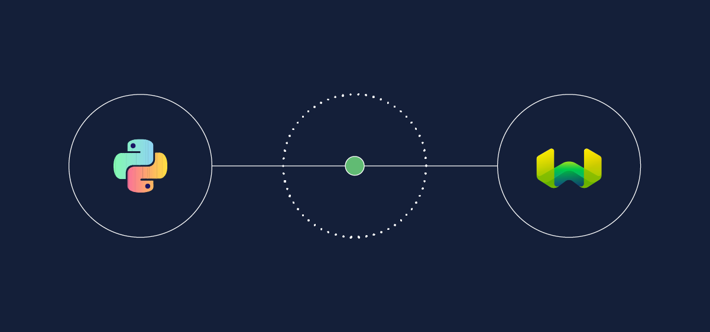

Weaviate `1.22` is here!

Here are the release ⭐️*highlights*⭐️ relating to this release:


<!-- truncate -->
1. **Nested object storage** - store nested objects directly in Weaviate as property values
2. **asynchronous vector indexing** - import large datasets faster by indexing vectors asynchronously
3. **Additional gRPC support** - preparing for the future with more gRPC support
4. **`v4` Python client beta** - try it out and let us know what you think!

:::tip Available on WCS
`1.22` is already available on [Weaviate Cloud Services](https://console.weaviate.cloud/) - so try it out!
:::

For more details, keep scrolling ⬇️!

## Nested object storage


`1.22` welcomes new members to the Weaviate data type family, with `object` and `object[]` joining the available list.

This allows you to store nested objects directly in Weaviate as property values. In other words, you can store them without having to flatten the object or use cross-references to other Weaviate classes.

This is particularly useful for storing data that is not easily represented in a flat structure. For example, nested properties let you work with an `address` value that has `number`, `street`, and city` properties of its own.

An example class definition is shown below, where a `Nested` class has a `parent` property with an `object` datatype. Because the `parent` property is an `object`, it can have its own properties (`nestedProperties`), such as `child` in this example, which is a `text` datatype.

```json
{
    "class": "Nested",
    "properties": [
        {
            "dataType": ["object"],
            "name": "parent",
            "nestedProperties": [
                {
                    "dataType": ["text"],
                    "name": "child"
                }
            ]
        }
    ],
}
```

An example object of this class may look like this:

```json
{
    "parent": {"child": "I'm nested!"}
}
```

Each nested property has its own data type. A nested property can be an `object` itself. This allows you to create nested structures of arbitrary depth.

<details>
  <summary>Two-level depth example</summary>

The following class definition shows a `DoublyNested` class with a `parent` property that is an `object` datatype, similarly to above. Here, however, the `child` property is itself an `object` datatype, and has its own `nestedProperties` of `childname` and `grandchild`.

```json
{
    "class": "DoublyNested",
    "properties": [
        {
            "dataType": ["object"],
            "name": "parent",
            "nestedProperties": [
                {
                    "dataType": ["object"],
                    "name": "child",
                    "nestedProperties": [
                        {
                            "dataType": ["text"],
                            "name": "childname",
                        },
                        {
                            "dataType": ["text"],
                            "name": "grandchild"
                        },
                    ]
                }
            ]
        }
    ]
}
```

An example object of this class may look like this:

```json
{
    "parent": {
        "child": {
            "childname": "Nested child",
            "grandchild": "I'm doubly nested!"
        }
    }
},
```

</details>

More practically, this type of structure may be applied to capture addresses, product information, or any other nested data structure. Take a look at the following example that shows a `Person` class with an `address` property that is an `object` datatype. The `address` property is able to store its own `nestedProperties` of `street` and `city`.

```json
{
    "class": "Person",
    "properties": [
        {
            "dataType": ["text"],
            "name": "last_name",
        },
        {
            "dataType": ["object"],
            "name": "address",
            "nestedProperties": [
                {"dataType": ["text"], "name": "street"},
                {"dataType": ["text"], "name": "city"}
            ],
        }
    ],
}
```

You can create a nested object for this class:

```json
{
    "last_name": "Franklin",
    "address": {
        "city": "London",
        "street": "King Street"
    }
}
```

### Auto-schema support for nested properties

Given that the `object` data types allow nested properties of arbitrary depth, you will be pleased to know that auto-schema supports nested properties. This means that you can create a class with nested properties without having to manually define the class structure.

If you create a property with the `object` datatype, Weaviate can automatically create the nested properties for you at import time. This may allow you to create a class from a large number of nested properties with ease.

This can provide a level of convenience for experimentation or evaluation, although as always you will get the most granular and exact control over the schema by defining it manually.

:::tip Not recommended for production use
Parsing objects at import time to infer the class definition may be slow for nested properties. Accordingly, we recommend that you manually specify the nested properties in the class definition as much as possible, especially in a production setting.
:::

### Future improvements

Please keep in mind that this is the first iteration of nested object storage in Weaviate, and we have further improvements planned.

In the current implementation, properties with `object` datatype do not affect the object vector, or the inverted index. Cross-reference properties have similar behavior whe the cross-referenced object is not indexed.

Future plans include the ability to index nested properties, for example to allow for filtering on nested properties and vectorization options.

## Performance improvements

The following features unlock further performance improvements in Weaviate `1.22`. Note that these are opt-in features at this point.

The `asynchronous vector indexing` feature must be enabled in the Weaviate configuration file, and the gRPC API is currently only supported through the new `v4` Python client (which is in beta).

### Asynchronous vector indexing (experimental)


:::caution Experimental
Due to the experimental nature of this feature, we recommend against using it in production environments.
:::

This release includes an experimental preview of our asynchronous vector indexing feature. With this, Weaviate now offers you the option de-coupling vector indexing from object creation. You can enable this to optimize imports for speed where vector indexing is not required immediately.

As of `1.22`, this is an opt-in feature. To enable asynchronous index, set `ASYNC_INDEXING` to true in your `docker-compose.yml` or equivalent configuration file.

In earlier versions of Weaviate, the HNSW index builds synchronously with object creation. A benefit of the synchronous approach is that the user can perform a search immediately after import, as the data is already indexed. However, synchronous index creation slows down the import process.

Starting with `1.22`, the vector indexing process can now be performed asynchronously to object creation. This means that the import process can go on independently to the indexing process and continue to create objects while the indexing process is ongoing.

The user can still perform vector searches as import progresses. Weaviate will search the vector index built to date as well as up to 100,000 un-indexed objects using brute force.

Currently, if async indexing is enabled, importing geo properties is slower than before. We expect to improve import speeds in an upcoming patch release.

#### Updated `nodes` endpoint

The `nodes` REST endpoint reflects these changes.

The `nodes` endpoint now has a new `INDEXING` status. The `stats` field now includes a `vectorQueueLength` field that contains the number of objects currently being indexed.

### Official gRPC support


The team continues to add gRPC support under the hood, with a big part of the equivalent GraphQL `Get` queries, and batch import functionality now available via gRPC.

With these changes, we have seen improvements in import speeds of around ~60-80% for batch imports, `Get` queries are many times faster, too. A big part of this speedup is because gRPC sends binary payloads over HTTP/2, and this provides improvements over GraphQL which uses JSON-based payloads over HTTP/1.

The upcoming `v4` Python client, supporting gRPC, will enable you to leverage these performance improvements.

If you are interested in the gRPC API, you can find the documentation including links to the proto files [on this page](https://weaviate.io/developers/weaviate/api/grpc).

:::note gRPC API changes

This release changes the implementation under the hood. If you were trying out gRPC in the past, this version may not be compatible with your existing code.

:::

## `v4` Python client beta



If you are wondering how to use the new gRPC functionality, we have you covered with the new Python client.

This client marks the first beta release of the `v4` client, with not only gRPC support but also an improved API. The new API is more Pythonic, with a focus on improving the user/developer experience. Custom classes and methods now trigger IDE auto-completion in place of untyped dictionaries.

As one example, an older collection creation requests that used to look like:

```python
# Existing (v3) Python client syntax
definition = {
    "class": "Question",
    "vectorizer": "text2vec-openai",
    "moduleConfig": {
        "generative-openai": {}
    }
}

client.schema.create_class(definition)
```

Now looks like:

```python
# New (v4) Python client syntax
import weaviate.classes as wvc

client.collections.create(
    name="Question",
    vectorizer_config=wvc.config.Configure.Vectorizer.text2vec_openai(),
    generative_config=wvc.config.Configure.Generative.openai()
)
```

And an older `near text` query like the following:

```python
# Existing (v3) Python client syntax
response = (
    client.query
    .get("Question", ["question", "answer", "category"])
    .with_near_text({"concepts": ["biology"]})
    .with_limit(2)
    .do()
)
```

Now looks like:

```python
# New (v4) Python client syntax
questions = client.collections.get("Question")
questions.query.near_text(query="biology", limit=2)
```

You may already have seen [a blog post](../2023-09-26-collections-python-client/index.mdx) about this new client, but we are excited to announce that it is now available in beta!

The documentation can be found on [this page](/developers/weaviate/client-libraries/python)

Given that this is a beta, please try it and let us know of any feedback [on this forum thread](https://forum.weaviate.io/t/python-v4-client-feedback-megathread/892).

Feedback can range from minor typos to missing features and everything in between. It can also be a positive comment, of course! We really look forward to hearing from you.

## Summary

That's all from us - we hope you enjoy the new features and improvements in Weaviate `1.22`. This release is already available on [WCS](https://console.weaviate.cloud/). So you can try it out yourself on a free sandbox, or by upgrading!

Thanks for reading, and see you next time 👋!
