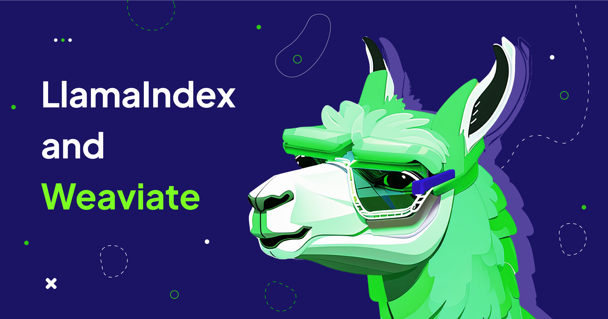

<!-- truncate -->

While large language models (LLMs) like GPT-4 have impressive capabilities in generation and reasoning, they have limitations in terms of their ability to access and retrieve specific facts, figures, or contextually relevant information. A popular solution to this problem is setting up a retrieval-augmented generation (RAG) system: combine the language model with an external storage provider, and create an overall software system that can orchestrate the interactions with and between these components in order to create a “chat with your data” experience.

The combination of Weaviate and LlamaIndex provide the critical components needed to easily setup a powerful and reliable RAG stack, so that you can easily deliver powerful LLM-enabled experiences over your data, such as search engines, chatbots, and more. First, we can use Weaviate as the [vector database](https://weaviate.io/blog/what-is-a-vector-database) that acts as the external storage provider. Next, we can use a powerful data framework such as LlamaIndex to help with data management and orchestration around Weaviate when building the LLM app.

In this blog post, we walk through an overview of LlamaIndex and some of the core data management and query modules. We then go through an initial demo notebook.

We’re kicking off a new series to guide you on how to use LlamaIndex and Weaviate for your LLM applications.

## An Introduction to LlamaIndex
LlamaIndex is a data framework for building LLM applications. It provides a comprehensive toolkit for ingestion, management, and querying of your external data so that you can use it with your LLM app.

### Data Ingestion
On data ingestion, LlamaIndex offers connectors to 100+ data sources, ranging from different file formats (.pdf, .docx, .pptx) to APIs (Notion, Slack, Discord, etc.) to web scrapers (Beautiful Soup, Readability, etc.). These data connectors are primarily hosted on [LlamaHub](https://llamahub.ai/). This makes it easy for users to integrate data from their existing files and applications.

### Data Indexing
Once the data is loaded, LlamaIndex offers the ability to index this data with a wide variety of data structures and storage integration options (including Weaviate). LlamaIndex supports indexing unstructured, semi-structured, and structured data. A standard way to index unstructured data is to split the source documents into text “chunks”, embed each chunk, and store each chunk/embedding in a vector database.

### Data Querying
Once your data is ingested/stored, LlamaIndex provides the tools to define an advanced retrieval / query “engine” over your data. Our retriever constructs allow you to retrieve data from your knowledge base given an input prompt. A query engine construct allows you to define an interface that can take in an input prompt, and output a knowledge-augmented response - it can use retrieval and synthesis (LLM) modules under the hood.

Some examples of query engine “tasks” are given below, in rough order from easy to advanced:
* Semantic Search: Retrieve the top-k most similar items from the knowledge corpus by embedding similarity to the query, and synthesize a response over these contexts.

* Structured Analytics: Convert natural language to a SQL query that can be executed

* Query Decomposition over Documents: Break down a query into sub-questions, each over a subset of underlying documents. Each sub-question can be executed against its own query engine.

## Demo Notebook Walkthrough

Let’s walk through a simple example of how LlamaIndex can be used with Weaviate to build a simple Question-Answering (QA) system over the Weaviate blogs!

The full code can be found in the [Weaviate recipes repo](https://github.com/weaviate/recipes/tree/main/integrations/llamaindex/simple-query-engine).

The first step is to setup your Weaviate client. In this example, we connect to an [Embedded Weaviate](https://weaviate.io/developers/weaviate/installation/embedded) instance.

```python
import os
import weaviate

# connect to your weaviate instance
client = weaviate.Client(embedded_options=weaviate.embedded.EmbeddedOptions(), additional_headers={ 'X-OpenAI-Api-Key': os.environ["OPENAI_API_KEY"]})
```

Ensure you have an Open AI API Key set up in your environment variables for use by the Weaviate client.

The next step is to ingest the Weaviate documentation and parse the documents into chunks. You can choose to use one of our many web page readers to scrape any website yourself - but luckily, the downloaded files are already readily available in the recipes repo.

```python
from llama_index import SimpleDirectoryReader
from llama_index.node_parser import SimpleNodeParser

# load the blogs in using the reader
blogs = SimpleDirectoryReader('./data').load_data()

# chunk up the blog posts into nodes
parser = SimpleNodeParser.from_defaults(chunk_size=1024, chunk_overlap=20)
nodes = parser.get_nodes_from_documents(blogs)
```

Here, we use the SimpleDirectoryReader to load in all documents from a given directory. We then use our `SimpleNodeParser` to chunk up the source documents into Node objects (text chunks).

The next step is to 1) define a `WeaviateVectorStore`, and 2) build a vector index over this vector store using LlamaIndex.

```python
from llama_index.vector_stores import WeaviateVectorStore
from llama_index import VectorStoreIndex, StorageContext

# construct vector store
vector_store = WeaviateVectorStore(weaviate_client = client, index_name="BlogPost", text_key="content")

# setting up the storage for the embeddings
storage_context = StorageContext.from_defaults(vector_store = vector_store)

# set up the index
index = VectorStoreIndex(nodes, storage_context = storage_context)
```

Our WeaviateVectorStore abstraction creates a central interface between our data abstractions and the Weaviate service. Note that the `VectorStoreIndex` is initialized from both the nodes and the storage context object containing the Weaviate vector store. During the initialization phase, the nodes are loaded into the vector store.

Finally, we can define a query engine on top of our index. This query engine will perform semantic search and response synthesis, and output an answer.

```python

​​query_engine = index.as_query_engine()
response = query_engine.query("What is the intersection between LLMs and search?")
print(response)
```

You should get an answer like the following:

```
The intersection between LLMs and search is the ability to use LLMs to improve search capabilities, such as retrieval-augmented generation, query understanding, index construction, LLMs in re-ranking, and search result compression. LLMs can also be used to manage document updates, rank search results, and compress search results. LLMs can be used to prompt the language model to extract or formulate a question based on the prompt and then send that question to the search engine, or to prompt the model with a description of the search engine tool and how to use it with a special `[SEARCH]` token. LLMs can also be used to prompt the language model to rank search results according to their relevance with the query, and to classify the most likely answer span given a question and text passage as input.
```

## Next Up in this Series

This blog post shared an initial overview of the LlamaIndex and Weaviate integration. We covered an introduction to the toolkits offered in LlamaIndex and a notebook on how to build a simple QA engine over Weaviate’s blog posts. Now that we have a baseline understanding, we will build on this by sharing more advanced guides soon. Stay tuned!

import WhatNext from '/_includes/what-next.mdx'

<WhatNext />
