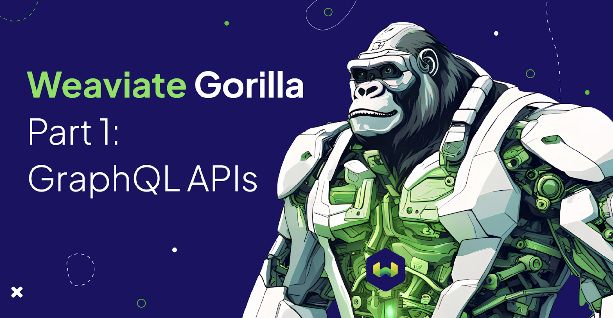
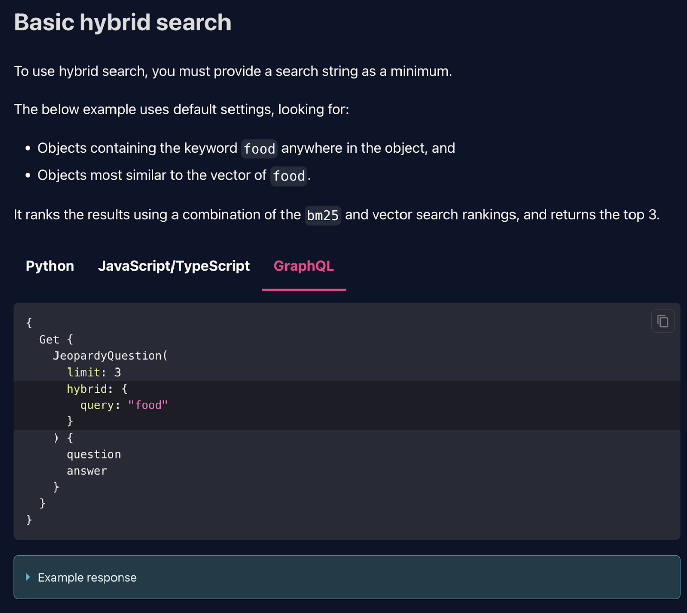

Following the new wave of excitement created by ChatGPT, AI hackers and researchers around the world quickly realized you could take LLMs even further by connecting them with tools. Tools are computations or services external to the LLM, such as a weather API, calculators, databases, and many others. These tools are interfaced to the LLM through API requests and responses. Gorilla is a new direction for LLMs, API Co-pilots achieved by fine-tuning LLMs to use a particular set of APIs. Weaviate has many APIs that help developers get running with production grade Retrieval-Augmented Generation! However, before LLMs, or human developers can access the power of Weaviate, they must learn the syntax. In this article, we present how we fine-tuned the LlaMA 7B open-source LLM to translate natural language commands into the Weaviate GraphQL Search APIs!

As a quick primer to GraphQL, [“GraphQL is a query language for your API, and a server-side runtime for executing queries using a type system you define for your data”](https://graphql.org/). Aside from the technical details of networking protocols, GraphQL is very visually appealing. Weaviate users love the intuitive aesthetics of GraphQL for controlling their Vector, BM25, Hybrid, Filtered, Symbolic Searches, and more. However, as mentioned before, there is still a bit of a learning curve to writing Weaviate GraphQL queries from memory. There is also an overhead for prompting an LLM to use these APIs.

To help with the training arc for humans and LLMs, we present WeaviateGraphQLGorilla, translating natural language commands to Weaviate queries! To get started, Weaviate users no longer need to wrap their heads around the difference between  `Get` and `Aggregate`, how to combine multiple operands in a Filtered Vector Search, or how to access properties in `_additional` to give a few examples. This blog post will dive into how we trained the LlaMA 7 billion parameter Large Language Model to write Weaviate GraphQL Search APIs. This includes how we generated a synthetic training dataset with [Self-Instruct prompting](https://arxiv.org/abs/2212.10560), how we optimized the model using Substratus and Kubernetes with HuggingFace’s incredible PEFT library, as well as future directions for the project and perspectives on LLM Tool Use, Agents, and the Gorilla research paper from [Patil et al.](https://arxiv.org/abs/2305.15334)

## The Auto API

Although this article has a research focus on how we developed the model, we are on a roadmap to eventually package this into Weaviate through the [`Auto` API](https://github.com/weaviate/weaviate/issues/3289). Thus, we begin the `WeaviateGraphQLGorilla` story by thinking about how the `Auto` API and how this project can help Weaviate users. The current [proposal](https://github.com/weaviate/weaviate/issues/3289) is to use `Auto` as follows:

```graphql
{
	Auto (
		query: “Show me the full name and email of contacts that contain John in their full name”
	){
	generatedQuery
	}
}
```

The `Auto` API allows you to simply tell Weaviate what kind of search you want and `WeaviateGraphQLGorilla` formats the request under the hood. This lets you execute your search, while also returning the `generatedQuery` lookup for learning purposes! To step a little more into how this works, we retrieve the Weaviate user’s custom schema from a running Weaviate instance with the [/v1/schema REST API](https://weaviate.io/developers/weaviate/api/rest/schema), feed that to a Weaviate RAG API serving the WeaviateGraphQLGorilla model with `generate`, and then generate away!

For example, the above query `Show me the full name and email of contacts that contain John in their full name` would get translated into the following GraphQL. Please note, this is an actual example of our Weaviate GraphQL Gorilla generating from a novel natural command, novel schema pair as input.

```graphql
{
	Get {
		Contact(
			where: {
				path: [“fullName”],
				operator: Like,
				valueText: “John*”
			}
		){
		fullName
		email
	}
}
```

## Training the Weaviate Gorilla

Before diving into the details, here is a bird’s eye view of the system we have built so far. Shown in Step 1, we use a Synthetic Database Schema and an API Reference to prompt GPT-3.5-16K to write the query shown in the reference customized to the schema. In Step 2, we use the Synthetic Database Schema, API Reference, and Synthetic Query from Step 1 to prompt GPT-3.5-16K to write an nlcommand for when a user would want to execute the synthetic query. Then in Step 3, we template the Synthetic NLCommand, Synthetic Database Schema, and API Reference to fine-tune the LlaMA 7B model to output the Synthetic Query produced in Step 1. We then evaluate the Gorilla model with Query Execution, LLM Eval, and N-Gram matching stratgies. We also evaluate how well Weaviate can retrieve the API Reference using the Synthetic NLCommand as input.


Building off the pioneering work of Patel et al. using Self-Instruct prompting, our model is trained on a novel dataset created by prompting `GPT-3.5-16K`. By prompting the highly capable Large Language Model, we are able to distill its performance into the more economical open-sourced [LlaMA 7B LLM](https://ai.meta.com/llama/).

`WeaviateGraphQLGorilla` is trained on a novel dataset of 46 Weaviate GraphQL Search APIs customized to a set of 50 synthetic Database schemas, totaling 2,300 examples which we split into 1,840 training examples (80%). and 460 testing examples (20%).

To better understand these synthetic schemas, the following is an example of a synthetic “Books” Weaviate schema for a fictional GreatReads.com. Please note, this schema was generated by GPT-4 from a prompt asking GPT-4 to write a novel use case given the reference on Weaviate schema syntax and some information about `Classes` and `properties` in Weaviate. GPT-4 was additionally asked to come up with at least 2 text properties and at least 1 int, boolean, and cross-reference property.

```
{
	“classes”: [
	{
		“class”: “Book”,
		“description”: “A book in the library.”,
		“vectorIndexType”: “hnsw”,
		“vectorizer”: “text2vec-transformers”,
		“properties”: [
		{
			“name”: “title”,
			“dataType”: [“text”],
			“description”: “The title of the book”
		},
		{
			“name”: “summary”,
			“dataType”: [“text”],
			“description”: “A summary of the book”
		},
		{
			“name”:  “pageCount”,
			“dataType”: [“int”],
			“description”: “The number of pages in the book.”
		},
		{
			“name”: “isAvailable”,
			“dataType”: [“boolean”],
			“description”: “Availability of the book in the library.”
		},
		{
			“name”: “author”,
			“dataType”: [“Author”],
			“description”: “The author of the book”
		}]
	},
	{
		“class”: “Author”,
		“description”: “An author of books.”,
		“vectorIndexType”: “hnsw”,
		“vectorizer”: “text2vec-transformers”,
		“properties”: [
		{
			“name”: “name”,
			“dataType”: [“text”],
			“description”: “The name of the author.”
		},
		{
			“name”: “age”,
			“dataType”: [“text”],
			“description”: “The age of the author.”
		}]
	}
      ]
}
```

Using the Weaviate Gorilla, we can help our fictional friends at GreatReads.com get running as fast as possible! We do this for 50 synthetic schemas across diverse applications in music, cars, AI models, and more!


Now let’s dive into how we trained the LlaMA-7B model to write Weaviate queries! `WeaviateGraphQLGorilla` learns how to write these queries just like anyone else, by reading the documentation!! Here is an example of the Weaviate API reference of “Hybrid Search”:



As mentioned previously, we combine the 50 toy schemas with 46 APIs such as the Hybrid Search example above and use these to prompt `GPT-3.5-turbo` to generate 2,300 examples. This takes 2 hours (128 minutes) to generate 2,300 queries and costs ~$12.00. We then split the data into 1,840 training examples and 460 examples for testing to fine-tune the open-source LlaMA-7B checkpoint with Retrieval-Aware Training.

Retrieval-Aware Training is an exciting direction for the future of Deep Learning in which the inputs to language model optimization are supplemented with retrieved context. We format the training examples by templating natural language commands into an input / prompt template with the retrieved API reference and custom schema.The LLM is then tasked with writing the ground truth GraphQL query from Self-Instruct data creation.

To train this model, we teamed up with Sam Stoelinga and Substratus. The LlaMA-7B model is loaded using HuggingFace’s `AuoTokenizer` and `AuotModelForCausalLM` with float16 weights. The model is then fine-tuned using the amazing `Peft` library from HuggingFace which interfaces the Low-rank Adaptation (LoRA) sparse training strategy. With this setup, training takes roughly 1 hour per epoch on Kuberenetes K8s. Language modeling perplexity loss begins at 1.1 and saturates to ~0.05 in roughly 250 mini-batches as visualized in the following learning curve graph:


Please see this [page](https://www.substratus.ai/) to learn more about Substratus. The training notebook for `WeaviateGraphQLGorilla` can be found [here](https://github.com/weaviate/Gorilla/blob/main/substratus/train-v4.ipynb) as well.

## Results

Let’s dive into what these models end up looking like! Following is an example of a generated GraphQL for a Custom Schema + API reference pair not used in the training data! From the command:

`Get me instruments with a hybrid search of ‘piano’, cutting results off with the first steep drop in the Hybrid Search score, and show the name, description, year introduced, whether it is a string instrument, and the name and genre of the players`.

`WeaviateGraphQLGorilla`’s Response:

```graphql
{
  Get {
    Instrument(hybrid: {query: "piano"}, autocut: 1) {
      name
      description
      yearIntroduced
      isString
      playedBy {
        name
        genre
      }
    }
  }
}
````

One of my personal favorite components to this project is how `WeaviateGraphQLGorilla` can route queries between Vector Searches and Symbolic Aggregations. From the command: `Show me the number of courses`.

Weaviate GraphQL Gorilla response:

```graphql
{
	Aggregate {
		Course {
			meta {
				count
			}
		}
	}
}
```

Now here is something I think is quite beautiful as well, using Vector Search to then filter results for a Symbolic aggregation. From the command: `What is the average complexity level of Yoga Poses that are similar to “Warrior Pose” with a maximum distance of 0.15?`.

Weaviate GraphQL Gorilla response:

```graphql
{
  Aggregate {
    YogaPose(nearText: {concepts: ["warrior pose"], distance: 0.15}) {
      complexityLevel {
        mean
      }
    }
  }
}
```

If you want to inspect the model for yourself you can find it here: https://huggingface.co/substratusai/weaviate-gorilla-v4! Please keep in mind that you need to follow the following prompt template to get `WeaviateGraphQLGorilla` to generate proper queries!

```python
Prompt = “””
## Instruction
Your task is to write GraphQL for the Natural Language Query provided. Use the provided API reference and Schema to generate the GraphQL. The GraphQL should be valid for Weaviate.

Only use the API reference to understand the syntax of the request.

##Natural Language Query
%s

## Schema
%s

## API reference
%s

## Answer
```graphql
“”” % (nlcommand, customSchema, apiReference)
```

## Quantitative Evaluation

Hopefully these visualizations of the Gorilla output on unseen test examples provides a solid indication of where the model is at. We are still kicking off the process of rigorous quantitative measurement, here are some of our thoughts on quantitative evaluation so far. Firstly, we want to ask: Do the WeaviateGraphQLGorilla queries execute? In order to do this, we loop through the synthetic schemas, creating them in Weaviate, sending the query, and measuring whether the response contains an error message or not. However, even if the query executes, it is still possible that it did not follow the instruction correctly.

To support more fine-grained metrics, we firstly plan on exploring GPT-4 Evaluations. This is where we prompt GPT-4 with the `[instruction, response]` pair and ask it to output “Yes” or “No” if the `response` followed the `instruction`. Similarly to the original Gorilla paper’s use of Abstract Syntax Tree evaluation, we are also considering an n-gram match where we construct keywords for each query such as “bm25”, “query”, “title” and check how many are contained in the generated query. We can also use the finer-grained perplexity metric that measures the log probability of the ground truth tokens at each step of decoding. We are currently using a simple greedy decoding algorithm to sample from the LoRA fine-tuned LlaMA 7B LLM.

To ground the evaluation discussion further, let’s take a look at an incorrect query:

```graphql
{
	Get {
		JobListing(
			bm25: {query: “software”}
			where: {path: [“salary”], operator: GreaterThan, valueNumber: 50000}
		){
		title
		description
		isRemote
		postedBy {
			name
		  }
		}
	}
}
```

Almost there! But unfortunately the missing comma from the `bm25` to `where` query will prevent this query from successfully executing. As discussed we may have other cases where although the syntax is correct and the query executes, it does not achieve what was specified in the natural language command. Here are the research questions we are currently exploring with our WeaviateGraphQLGorilla project.

## Research Questions

**RQ1: Does WeaviateGraphQLGorilla generalize to new schemas?**

Probably the most imporatnt test for productizing WeaviateGraphQLGorilla in something like the `Auto` API proposal – Does WeaviateGraphQLGorilla generalize to a Weaviate Schema not seen in training?

We measure RQ1 by splitting the 50 toy schemas into 40 to use in training, and 10 for testing.

**RQ2: How well does WeaviateGraphQLGorilla generalize to new APIs?**

Maybe the most important test when considering the maintenance of WeaviateGraphQLGorilla – If we add a new API to Weaviate, do we need to re-train Gorilla?

We measure RQ2 by splitting the 46 API references into 37 for training, and 9 for testing.

**RQ3: How well does WeaviateGraphQLGorilla generalize from Atomic to Compositional APIs?**

An Atomic API illustrates a single concept, such as a BM25 query, retrieving the vector for an object, or counting the number of objects. A Compositional API combines say BM25 + Where + Get Vector.

**RQ4: Retrieving the correct API reference**

Shown below, the original Gorilla paper from Patil et al. finds a massive improvement with Oracle context versus tested retrieval systems.


As evidenced from Patil et al., high quality retrieval helps a lot! Our Weaviate Gorilla experiments gave us a chance to better understand categories of Retrieval Augmented Generation. This is certainly a deep topic, but let’s try to summarize the retrieval components into 5 categories:

* JSON retrieval
* SQL retrieval
* Vector Search retrieval
* Knowledge Graph retrieval
* Classification retrieval

Classification retrieval describes classifying the query into one of several categories, in our case 1 of the 46 documented API references, and using this classification to route which information is added to the LLM’s context for generation.

Let’s contrast this with Vector Search retrieval particularly where we might use the `nlcommand` as our query vector to hit an HNSW index of vectorized API references. This works fairly well, additionally supplemented by BM25, Hybrid Search, and Reranking Search APIs. The interesting research question is: At what scale does this become an information retrieval problem? Please see our discussion on the `WeaviateIntegrationGorilla`.

**RQ5: How robust is WeaviateGraphQLGorilla to noisy retrieval?**

What is Weaviate returns the wrong API reference for an nlcommand?

To conclude, we have exciting plans for this project! As discussed, we are currently focused on collecting quantitative metrics to better understand the performance of WeaviateGraphQLGorilla, and the impact of miscellaneous tweaks such as adding more training data or maybe fine-tuning from the new Code LlaMA checkpoint!

**RQ6: How robust is WeaviateGraphQLGorilla to paraphrases of the nlcommands?**

In order to package WeaviateGraphQLGorilla in something like the `Auto` API, we want to be able to support diverse styles in the `nlcommands`. In order to measure this we aim to prompt GPT-4 to produce paraphrases of the original nlcommands and report if the model is still able to generate the correct query.

## Discussion

### Gorilla Ecosystem

We are also very excited to participate in the broader Gorilla ecosystem and contribute our search APIs to the APIZoo. The current Gorilla models are trained to select the right pre-trained Deep Learning model for a task. In the case of semantic search embedding models, Weaviate plays a critical role in enabling use of that particular tool. If interested in learning more, please check out our [64th Weaviate Podcast with Shishir Patil and Tianjun Zhang](https://www.youtube.com/watch?v=HUtYOLX7HZ4) and the Gorilla repo [here](https://github.com/ShishirPatil/gorilla)!

### Integration Gorillas

We are beyond excited about how Gorillas will let users build apps from Natural Language commands such as:

`Build a Llama Index Query Engine with Weaviate from my Notion Workspace titled “Biochemistry Chapter4”`

We can also imagine more complex integrations, such as adding the following to the original command.

`Please chunk the text with Unstructured and vectorize with OpenAI embeddings. Please add a Cohere Re-ranker and a LlaMA 7B LLM to the system.`

This is a very interesting emerging landscape of Machine Learning software integrations. Potential directions include: (1) Weaviate maintaining the LLM that does all of the integrations in Weaviate’s documentation, (2) Weaviate’s Gorilla interfaces with 3rd party Gorillas such as a LlamaIndex Gorilla, or (3) the open-source APIZoo effort from Patil et al. can cover all software integrations, creating a very nice harmony in the open-source ecosystem. All directions seem likely to be explored in the surge of LLM fine-tuning.

### WeaviatePythonGorilla

In addition to the WeaviateIntegrationGorilla, we also foresee the development of WeaviatePythonGorilla and WeaviateJavaScriptGorilla! These additional Gorillas will offer similar search functionality to the WeaviateGraphQLGorilla we have presented, but additionally enabling control for the Weaviate CRUD operations! This entails automatically creating, updating, or adding schemas, importing data, and potentially setting replication or multi-tenancy configurations!

### LLM Tool Use and Future Directions

Several works before Weaviate Gorilla have illustrated the performance of connecting LLMs with external tools broadly. In [ReAct](https://arxiv.org/abs/2210.03629), Yao et al. interface `search[entity]`, `lookup[string]`, and `finish[answer]` APIs in a Zero-Shot prompt to supercharge performance on multi-hop QA (HotpotQA) and Fact Verification (FEVER). In [Toolformer](https://arxiv.org/abs/2302.04761), Shick et al. illustrate a self-supervised strategy to fine-tune LLMs to use search and calculator APIs. [WebGPT](https://openai.com/research/webgpt) from Nakano et al. smilarly fine-tunes GPT-3 to leverage web-browsing actions. These works mostly focus on the task of converting a prompt, or input, into an appropriate search query to supplement the context.

As presented with related works above, most RAG architectures connecting LLMs to Search Engines have only interfaced surface-level controls to the LLM. Weaviate Gorilla aims to arm the LLM with controls such as filter search, routers between vector or symbolic search as mentioned earlier, as well as high-level data structures, such as `Classes` and `properties`.

Let’s consider the impact of Gorillas on the future of Database management, [LLM as DBA](https://arxiv.org/pdf/2308.05481.pdf). Pavlo et al. define a Self-Driving Database Management that [“automatically (1) decides what actions to use to optimize itself, (2) decides when to deploy those actions, and (3) learns from those actions – all without human intervention”](https://www.cs.cmu.edu/~pavlo/blog/2018/04/what-is-a-self-driving-database-management-system.html).

Weaviate Gorilla may optimize itself by tuning the alpha parameter in Hybrid Search, tuning how leverage `Reranking` and `where`, and perhaps even diving deeper into the configuration of HNSW hyperparameters such as `efConstruction` and `maxConnections` or PQ hyperparameters such as the `segments`. We may also imagine Gorillas that create new Classes or properties, tying nicely with emerging ideas around Generative Feedback Loops! Finally, we may imagine Gorillas that help with cloud monitoring metrics and helping users navigate multi-tenancy, replication, backup management, and more!

## Thank you for Reading!

Thank you so much for reading this article introducing the Weaviate Gorilla project and presenting our first model, `WeaviateGraphQLGorilla`. We have quite an exciting roadmap ahead and would really appreciate your eyeballs on the `Auto` API proposal for interfacing the Gorilla models in Weaviate!

Huge thanks to Sam Stoelinga for the collaboration on this project, please check out Substratus to finetune and serve LLMs on K8s here!

There are tons of directions to explore in the future of Gorilla! If you are interested in learning more or sharing your journey with building Gorillas for your software, please feel free to reach out to me @CShorten30 on X, as well as how to connect with the broader Weaviate team from the links below!

## Connect with us!

Check out Getting Started with Weaviate, and begin building amazing apps with Weaviate.

You can reach out to us on Slack or Twitter, or join the community forum.

Weaviate is open source, and you can follow the project on GitHub. Don’t forget to give us a ⭐while you are there!